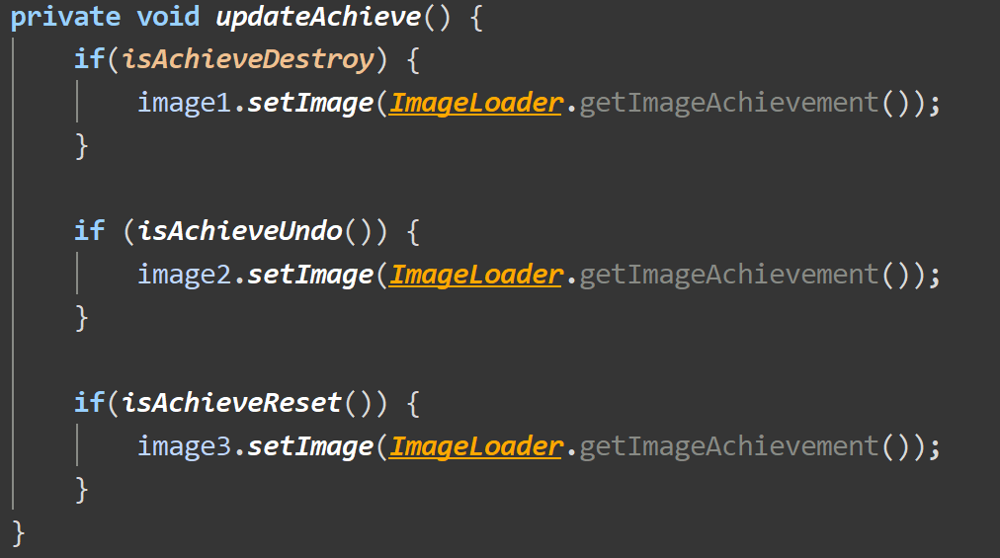
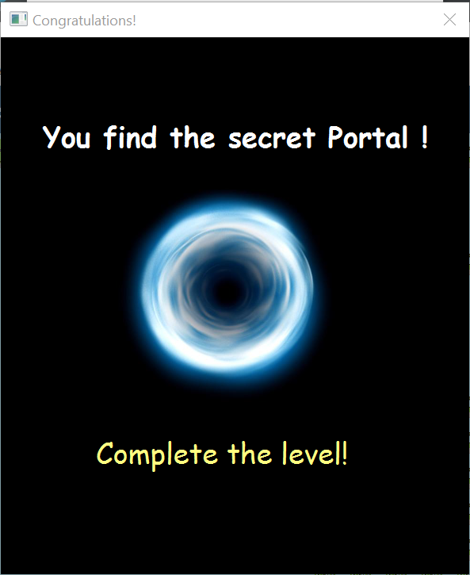

# AE2DMS-CW-20123783

number of words: 210

number of figures: 33

number of tables: 25


   # Content

| Outline                      | Sections                                                     |
| ---------------------------- | ------------------------------------------------------------ |
| [**Guide**](#guide)          |                                                              |
| [**Basic features**](#basic) |                                                              |
| [**Maintenance**](#1)        | [MVC Pattern](#mvc)<br>[Factory Pattern](#factory)<br>[State Pattern](#state)<br>[Singleton Pattern](#singleton) |
| [**Extension**](#2)          | [Overall](#overall)<br/><br>[Destroy walls](#destroy)<br>[Achievements](#achievements)<br>[Reverse move](#reverse)<br>[Portal](#portal)<br>[Setting](#setting)<br>[Add animation](#animation)<br>[Real-time move count and name](#count) |
| [**Test cases**](#3)         | [MainTest](#main)<br>[startControllerTest](#startController)<br>[gameControllerTest](#gameController)<br>[settingControllerTest](#settingController)<br>[infoControllerTest](#infoController)<br>[all other info controller tests](#other)<br>[GameEngineTest](#gameengine)<br>[GameGridTest](#gamegrid) |

<br>

<br>

<a name = "guide"></a>

# Guide

#### Run project

1. Download .zip from GitLab and extract.

2. Use IntelliJ Idea to open file.

3. "project structure" -> "Library" -> "+" to add lib.

4. "Edit Configuration" to set VM Option. 

   ```
   --module-path
   %PATH%
   --add-modules
   javafx.controls,javafx.fxml
   --add-modules
   javafx.controls,javafx.media
   --add-modules
   javafx.controls,javafx.graphics
   ```

5. Then run Main class.

<br>

#### Run jar

1. Download "SokobanFX-1.0-SNAPSHOT-jar-with-dependencies.jar" in "SokobanFX" folder from GitLab.

2. Use IntelliJ Idea to open file.

3. "Edit Configuration" to set VM Option.

   ```
   --module-path
   %PATH%
   --add-modules
   javafx.controls,javafx.fxml
   --add-modules
   javafx.controls,javafx.media
   --add-modules
   javafx.controls,javafx.graphics
   ```

4. Then run "SokobanFX-1.0-SNAPSHOT-jar-with-dependencies.jar".

<br>

#### Generate jar from Maven

1. Click "package" in Maven.
2. Then follow Run jar ("SokobanFX-1.0-SNAPSHOT-jar-with-dependencies.jar" is in "target" folder).

<br>

#### Another way to generate jar

1. "project structure" -> "Artifacts" -> "+" -> "from modules with dependencies" -> choose com.ae2dms.Main as main class.
2. "Build" -> "Build Artifacts"
3. Run "SokobanFX.jar" in "out" folder.

<br><br>

<a name = "basic"></a>

# Basic features

| Feature   | Some rules                                                   |
| --------- | ------------------------------------------------------------ |
| Undo      | 1. Keeper can undo many times until reach the initial point.<br>2. If reach the initial point, a dialog will be shown to tell user that it is the initial position.<br>3. Undo will not add up move count. Thus, use undo rather than move back. |
| Load file | If user has loaded file, he/she will not be included in the high score pop-up. Because it may be unfair for others. |
| Rank      | 1. Score = 10000 - move count<br>2. It will be shown after completing each level.<br>3. Top 20 scores will be shown. |

 <br><br>

<a name = "1"></a>

# Maintenance

 <a name = "mvc"></a>

### MVC Pattern

|            | Description                                                  | Images                               |
| ---------- | ------------------------------------------------------------ | ------------------------------------ |
| Model      | Model in this project is the package 'com.ae2dms.model'.<br>Classes in this package are mostly used for processing data. |            |
| View       | View in this project is the 'fxml' folder in resources.<br>All the fxml files in this folder are used for providing a visualised interface for users. |              |
| Controller | Controller in this project is the 'com.ae2dms.controller' package. <br/>Controller is used to get data from View, send it to Model, receive response from Model and reply to View. |  |

<br>

<br>

 <a name = "factory"></a>

### Other design patterns

| Pattern               | Where                                                        | Why                                                          |
| --------------------- | ------------------------------------------------------------ | ------------------------------------------------------------ |
| **Factory Pattern**   | I use this pattern in High score pop-up.                     | The high score pop up will be shown after finishing each level, so it should be easy to expand. Every time add a level, the code in GameEngine should be modified.<br>After applying Factory Pattern, developer only need to add a new class which implement rank interface and no need to access GameEngine. |
| **State Pattern**     | I use this pattern in HandleKey() which identify key press and call the corresponding methods. | I add a feature called 'reverse move', which means the direction keeper actually move is opposite from the key user press.<br>Thus, there are two states, normal move and reverse move. State Pattern is suitable for this situation to better identify different actions in two states. |
| **Singleton Pattern** | I use this pattern in showAbout().                           | Because showAbout() can be directly access to gameController without connecting with other objects. |

<br>

<br>

#### Factory Pattern

| levelComplete() in GameEngine                                | rank package                                                 |
| ------------------------------------------------------------ | ------------------------------------------------------------ |
|  |  |

<br>

<br>

 <a name = "state"></a>

#### State Pattern


<br>

<br>

 <a name = "singleton"></a>

#### Singleton Pattern


<br>

<br>


 <a name = "2"></a>
# Extension

 <a name = "overall"></a>

| Feature                                     | Description                                                  | Where                                                        | Why                                                          |
| ------------------------------------------- | ------------------------------------------------------------ | ------------------------------------------------------------ | ------------------------------------------------------------ |
| **Destroy walls**                           | Users can destroy walls by pressing 'W' 'A' 'S' 'D'. It may help those who feel the game difficult to complete the level.<br>If there is no wall in specified direction, it will perform as move. However, if wall exists, it will be destroyed. At the same time, move count will add 20 after destroying one wall in order to keep game balanced. | Create a method in GameEngine                                | This feature helps users to 'break rules' to achieve the goal quickly, but it also cost much. Thus, users should consider which way costs less move counts, move step by step or destroy a wall to create a new way. |
| **Achievements**                            | If meet some specific conditions,  a dialog will be shown to tell user that he/she has got the achievement. <br>Otherwise, golden cup will be lit on the top. If click the cup, a dialog which shown the handbook of all achievements. Achievements user has got will be shown while others are invisible. | Calculate rank, read from file and write in file is in GameEngine.<br>Show rank is in gameController. | Encourage users to explore the game in order to collect all achievements. Moreover, users may have a sense of accomplishment after getting achievements. |
| **Reverse move**                            | Users can open or close 'reverse move' mode by clicking 'reverse move' in 'More'. After open this mode, each movement will be opposite. | Modify move() in GameEngine                                  | This feature may make users feel uncomfortable because it is opposite. Someone who wants to play a more challenging game can open this mode. |
| **Portal**                                  | Every level has a secret portal, which will lead to the winning of current level. The portal is invisible and is settled in a specific position. When keeper move to this position, portal triggers. | GameEngine                                                   | It's an 'Easter Eggs' for users. They can spend much less movements to pass the level.<br>When users meet portal, they may feel very surprised and exited. |
| **Setting**                                 | Users can choose the images of FLOOR, WALL, KEEPER and CRATE. | Create new controller and fxml                               | Users can choose the objects they prefer. They can enjoy the progress of design their own colour scene. |
| **Add animation**                           | An animation of title 'Sokoban' is settled in the start page. | Add new methos in Main class                                 | To make the start page more active.                          |
| **Add real-time move count and level name** | The real-time move count and the name of current level will be shown on the top of the page. | gameController                                               | Let users know their current move count and maybe get some hint from level name. |


 <a name = "destroy"></a>

### 1. Destroy walls

| Code                                                         | Performance                                                  |
| ------------------------------------------------------------ | ------------------------------------------------------------ |
|  | <br><br> |

<br><br>

 <a name = "achievements"></a>

### 2. Achievements

| Code                                                         | Performance                                                  |
| ------------------------------------------------------------ | ------------------------------------------------------------ |
|  |  |
|  | <br><br> |
|  |  |
|  |  |
|  |  |

<br>

<br>

 <a name = "reverse"></a>

### 3. Reverse move


<br>

<br>

 <a name = "portal"></a>

### 4. Portal

| Code                                                         | Performance                                                  |
| ------------------------------------------------------------ | ------------------------------------------------------------ |
|  |  |

<br>

<br>

 <a name = "setting"></a>

### 5. Setting (choose objects)

| Class                                                        | Performance                                                  |
| ------------------------------------------------------------ | ------------------------------------------------------------ |
| <br><br> |  |

<br>

<br>

 <a name = "animation"></a>

### 6. Add animation


<br>

<br>

 <a name = "count"></a>

### 7. Add real-time move count and level name


<br>

<br>

<a name = "newLevel"></a>

### 8. Add new level

I add a new level full of walls :)


**Why**

I want users who do not use 'destroy walls' to use it and try to find the shortest route to complete this special level.


 <a name = "3"></a>

# Test cases

 <a name = "main"></a>

### MainTest

| Method | Description       | Expected        | Actual          |
| ------ | ----------------- | --------------- | --------------- |
| start  | start of the game | show start page | show start page |

<br>

<br>

 <a name = "startController"></a>

### startControllerTest

#### Test buttons

| Method    | Description                                     | Expected                                          | Actual                                            |
| --------- | ----------------------------------------------- | ------------------------------------------------- | ------------------------------------------------- |
| startGame | click the 'start' button and start playing game | button exist and <br>open game after click        | button exist and <br/>open game after click       |
| showInfo  | click the 'Info' button and show how to play    | button exist and <br>text in the label is correct | button exist and <br>text in the label is correct |

<br>

<br>

 <a name = "gameController"></a>

### gameControllerTest

#### Test buttons

| Method              | Description                                | Expected                                                     | Actual                                                       |
| ------------------- | ------------------------------------------ | ------------------------------------------------------------ | ------------------------------------------------------------ |
| ensureMenuBar       | test menu bar                              | menu bar exist and <br>the number of menu items <br>is correct | menu bar exist and <br/>the number of menu items <br/>is correct |
| updateMoveCount     | test label which show the move count       | button exist and <br>text in the label is correct            | button exist and <br>text in the label is correct            |
| ensureMenuItemFile  | Test whether menuItems in File are exist.  | id exist                                                     | id exist                                                     |
| ensureMenuItemLevel | Test whether menuItems in Level are exist. | id exist                                                     | id exist                                                     |
| ensureMenuItemAbout | Test whether menuItems in About are exist. | id exist                                                     | id exist                                                     |
| ensureMenuItemMore  | Test whether menuItems in More are exist.  | id exist                                                     | id exist                                                     |

<br>

#### Test new dialogs

| Method                     | Description                 | Expected          | Actual            |
| -------------------------- | --------------------------- | ----------------- | ----------------- |
| testShowBuff               | test showBuff               | texts are correct | texts are correct |
| testShowAchievementDestroy | test showAchievementDestroy | texts are correct | texts are correct |
| testShowAchievementUndo    | Test showAchievementUndo    | texts are correct | texts are correct |
| testShowAchievementReset   | Test showAchievementReset   | texts are correct | texts are correct |

<br>

<br>

 <a name = "settingController"></a>

### settingControllerTest

#### Test 'cancel' button

| Method | Description                                | Expected                                    | Actual                                       |
| ------ | ------------------------------------------ | ------------------------------------------- | -------------------------------------------- |
| goBack | test whether can go back to the start page | start page has been loaded<br>buttons exist | start page has been loaded<br/>buttons exist |

<br>

#### Test 'save' button and radio buttons

| Method          | Description                                         | Expected                                                     | Actual                                                       |
| --------------- | --------------------------------------------------- | ------------------------------------------------------------ | ------------------------------------------------------------ |
| saveSettingInit | test whether get the initial value of radio buttons | settingController.chosenFloor == 1<br>settingController.chosenWall == 1<br>settingController.chosenKeeper == 1<br>settingController.chosenCrate == 1 | settingController.chosenFloor == 1<br/>settingController.chosenWall == 1<br/>settingController.chosenKeeper == 1<br/>settingController.chosenCrate == 1 |
| saveSettingFK2  | test whether set the correct value                  | settingController.chosenFloor == 2<br/>settingController.chosenWall == 1<br/>settingController.chosenKeeper == 2<br/>settingController.chosenCrate == 1 | settingController.chosenFloor == 2<br/>settingController.chosenWall == 1<br/>settingController.chosenKeeper == 2<br/>settingController.chosenCrate == 1 |

<br>

<br>

 <a name = "infoController"></a>

### infoControllerTest

#### Test labels and buttons

| Method    | Description                                | Expected                                              | Actual                                                 |
| --------- | ------------------------------------------ | ----------------------------------------------------- | ------------------------------------------------------ |
| backStart | test whether can go back to the start page | start page has been loaded<br>buttons exist           | start page has been loaded<br/>buttons exist           |
| next      | test whether can go to the next page       | next page has been loaded<br>correct topic and labels | next page has been loaded<br/>correct topic and labels |

<br>

<br>

 <a name = "other"></a>

### all other controllerTest of Info

#### Test labels

| Method | Description                                   | Expected                                                  | Actual                                                     |
| ------ | --------------------------------------------- | --------------------------------------------------------- | ---------------------------------------------------------- |
| back   | test whether can go back to the previous page | previous page has been loaded<br>correct topic and labels | previous page has been loaded<br/>correct topic and labels |
| next   | test whether can go to the next page          | next page has been loaded<br>correct topic and labels     | next page has been loaded<br/>correct topic and labels     |

<br>

<br>

 <a name = "gameengine"></a>

### gameEngineTest

#### Test handleKey(KeyCode code)

| Method                | Description                                | Expected       | Actual         |
| --------------------- | ------------------------------------------ | -------------- | -------------- |
| handleKeyUp           | test whether move() has been called        | isHandle == 1  | isHandle == 1  |
| handleKeyDown         | test whether move() has been called        | isHandle == 1  | isHandle == 1  |
| handleKeyLeft         | test whether move() has been called        | isHandle == 1  | isHandle == 1  |
| handleKeyRight        | test whether move() has been called        | isHandle == 1  | isHandle == 1  |
| handleKeyDestroyUp    | test whether destroyWall() has been called | isDestroy == 1 | isDestroy == 1 |
| handleKeyDestroyDown  | test whether destroyWall() has been called | isDestroy == 1 | isDestroy == 1 |
| handleKeyDestroyLeft  | test whether destroyWall() has been called | isDestroy == 1 | isDestroy == 1 |
| handleKeyDestroyRight | test whether destroyWall() has been called | isDestroy == 1 | isDestroy == 1 |
| handleKeyUndo         | test whether moveBack() has been called    | isUndo == 1    | isUndo == 1    |

<br>

#### Test move(Point delta)

| Method    | Description                                       | Expected                                    | Actual                                      |
| --------- | ------------------------------------------------- | ------------------------------------------- | ------------------------------------------- |
| moveUp    | test whether keeper has moved to the target point | keeper position: (1, 13)<br/>object matches | keeper position: (1, 13)<br/>object matches |
| moveDown  | test whether keeper has moved to the target point | keeper position: (3, 13)<br/>object matches | keeper position: (3, 13)<br/>object matches |
| moveLeft  | test whether keeper has moved to the target point | keeper position: (2, 12)<br/>object matches | keeper position: (2, 12)<br/>object matches |
| moveRight | test whether keeper has moved to the target point | keeper position: (2, 14)<br/>object matches | keeper position: (2, 14)<br/>object matches |

<br>

#### Test moveBack()

| Method               | Description                                                  | Expected                                                     | Actual                                                       |
| -------------------- | ------------------------------------------------------------ | ------------------------------------------------------------ | ------------------------------------------------------------ |
| moveBackWithoutCrate | test whether keeper has moved to the previous point          | keeper position: (2, 14)<br>objects match                    | keeper position: (2, 14)<br/>objects match                   |
| moveBackWithCrate    | test whether keeper and crates have moved to the previous point | keeper position: (2, 11)<br/>crate position: (2, 10)<br> objects match | keeper position: (2, 11)<br/>crate position: (2, 10)<br/> objects match |

<br>

#### Test moveFirst()

| Method    | Description                                                  | Expected                                                     | Actual                                                       |
| --------- | ------------------------------------------------------------ | ------------------------------------------------------------ | ------------------------------------------------------------ |
| moveFirst | test whether keeper and crates have moved to the initial points | keeper position: (2, 13)<br>crate position: (2, 10)<br>objects match | keeper position: (2, 13)<br/>crate position: (2, 10)<br/>objects match |

<br>

<br>

 <a name = "gamegrid"></a>

### GameGridTest

#### Test translatePoint(Point sourceLocation, Point delta)

| Method         | Description                            | Expected    | Actual      |
| -------------- | -------------------------------------- | ----------- | ----------- |
| translatePoint | test whether point has been translated | Point(1, 0) | Point(1, 0) |

<br>

#### Test removeGameObjectAt(Point position)

| Method             | Description                                                  | Expected       | Actual         |
| ------------------ | ------------------------------------------------------------ | -------------- | -------------- |
| removeGameObjectAt | test whether the object on the specific position has been removed | null on (0, 0) | null on (0, 0) |

<br>

#### Test putGameObjectAt(GameObject gameObject, int x, int y)

| Method          | Description                                                  | Expected                    | Actual                      |
| --------------- | ------------------------------------------------------------ | --------------------------- | --------------------------- |
| putGameObjectAt | test whether the object has been put on the specific position | GameObject.KEEPER on (0, 0) | GameObject.KEEPER on (0, 0) |

<br>

#### Test putGameObjectAt(GameObject gameObject, Point p)

| Method          | Description                                                  | Expected                    | Actual                      |
| --------------- | ------------------------------------------------------------ | --------------------------- | --------------------------- |
| putGameObjectAt | test whether the object has been put on the specific position | GameObject.KEEPER on (0, 0) | GameObject.KEEPER on (0, 0) |


